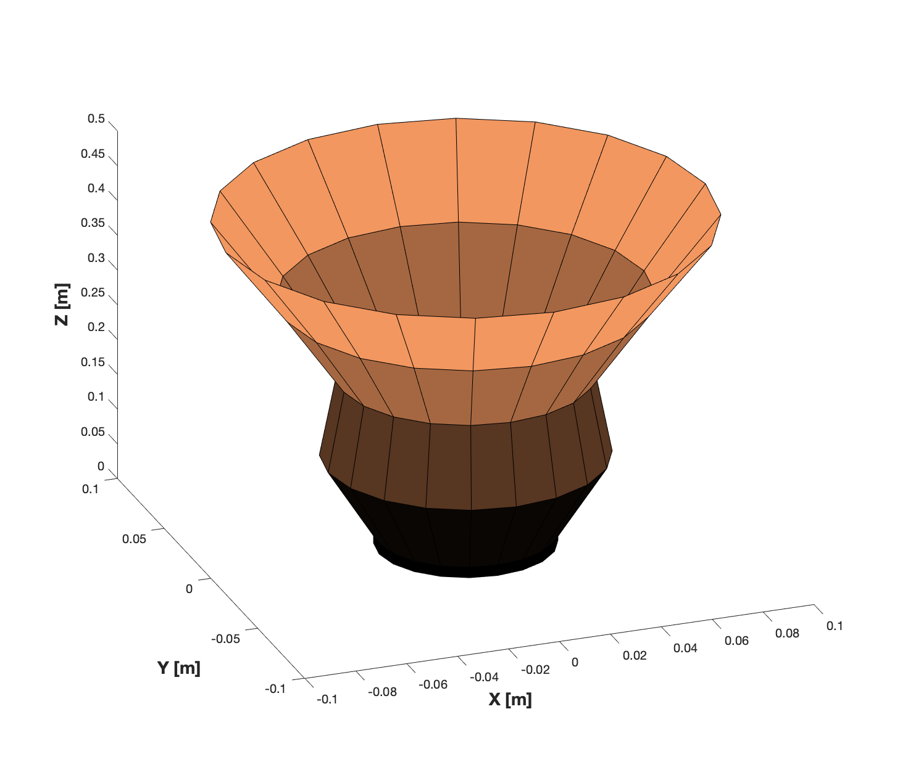
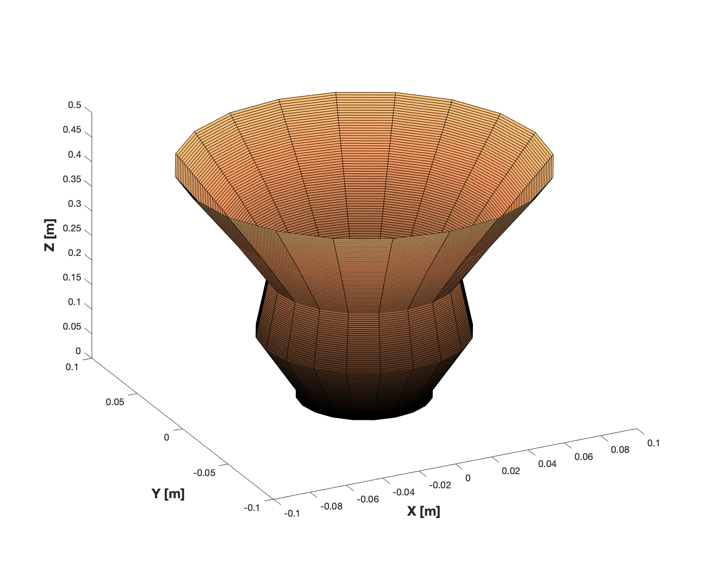

## TWORIT [Theoretical solver and Waveguide Optimization for Radiating Irregular Tapered-Cones] v1.0

This tool is about calculating the S parameters and Far Fields of a cascaded cylindrical waveguide structure or a conical waveguide of arbitrary cross-sections. It is based on the Mode Matching Technique. The tool also contains the optimization of arbitrarily profiled smooth conical horn antennas based on a desired reflection coefficient. The same code can be modified to add certian other optimization goals, such as, the cross polarization levels and antenna efficiencies. 


For details, follow the reference [1]. 

### Deliverables:

#### Deliverable 1: REF.m [Geometry and Computes S parameters]

The file `REF.m` is used to compute the S parameters and store them in a `.mat` file format. The file `Plot_Sparam.m` helps in plotting the S parameters one by one (with input options). One successful run of `REF.m` is shown in the command-line output window of MATLAB format below. 

Example geometries of the three cylinder cascaded waveguide structure and a Conical profile are stored in `GEO_plots` for reference. In the cone folder you can find a approx conical structure as well. That happens to be there because the conical structure is always discretized with a set of cylindrical waveguides of length &lambda `/10` where, $\lambda$ corresponds to the wavelength corresponding to the maximum frequency of operation given by the user. Example S parameters of the same geometrical structures are stored in `S_param` folder. The `Plots` folder contains some example plots of the S parameters. 

Example conical structure: (Derived from [1])



Example approximate model of the same conical horn antenna for Mode Matching solver:



It contains both the process of creating the Geommertry and processing for S parameters. It is a two step process.

#### Deliverable 2: Plot_Sparam.m [Plots S parameters]

The file `Plot_Sparam.m` plots the S parameters from mat files saved with S parameters. It asks to
select a mat file in the beginning. It also asks about the type of S parameters to be plotted.
Ususual conventions: R is the base waveguide, T is a final waveguide in the structure. The mode serial 
numbers are listed in `modes.csv` [Best viewd on MATLAB]. For example, SRR is S parameters for the 
base waveguide and an input of 1 and 8 in mode numbers is for  `TE11 polarization 0` with 
`TM11 polarization 90`. 

#### Deliverable 3: REF_FF.m [Geometry, Computes S parameters and Far Fields]

The file `REF_FF.m` is the complete package. It starts with the options to input the Geometry,
the S parameters option and also the Far fields options. 

#### Deliverable 4: Plot_Geomat.m [Plots the Geometry only from a mat file with saved geometry]

#### Deliverable 5: Plot_FF.m [Plots The far fields from a saved mat file for Far Fields]

#### Deliverable 6: FF_FROM_GEO_GSM.m [Computes Far Fields with a given mat files for Geometry and S parameters]

This deliverable is a special case of deliverable 3, because here the geometry and S parameters can be fed with
mat file inputs. 

#### Deliverable 7: GEO_Con.m [To create the geometry and save it in a mat file]

This deliverable explicitly deals with the creation of the antenna geomerty and it asks to save it in a file.

#### Deliverable 8: REF_FROM_GEO.m [Computes S parameters from a given geometry]

This deliverable is a special case of deliverable 1. In this case, the geometry is given directly from a saved 
geometry mat file. This mat file for geometry can be generated from deliverable 7.

#### Deliverable 9: REF_Opt.m [Optimization of the geometry of smooth conical horn antenna with arbitrary profiles]

This deliverable is an example of the conical horn optimization with arbitrary tapered profile. The goal of the optimization is to achieve a desired level of reflection coefficient. It uses the MATLAB optimization toolbox with gradient descent [Quasi-Newton] or genetic algorithm. 

### Special features:

1) It is faster than the conventional EM solvers because it is completely analytical.
2) Based on the input frequency range by the user, it does a smart selection of modes per waveguide to reduce computational complexity and to get more accurate results. 

### Warning:

1. The tool is not yet robust for dielectric materials inside the waveguides. 
2. It works perfectly in the free space mode (Relative dielectric permittivity &epsilon `_r = 1` and Relative dielectric permeability &mu `_r = 1`).
3. The aperture reflection option in far fields is not validated completeley. For `TE` excitation it is validated.
It is for research purposes. If the aperture reflection option is not choosen, the computation takes into account
the fact that the waveguide is perfectly matched to the free space. 
4. For cascaded cylindrical geometry input, the algorihms are not designed to take number of cylinders as `1`.
It should be alwys more than 1. If you want to study the far fields of one single waveguide, please input the
number of cylinders as `2` and the same radius can be given to both the elements. The original length of the 
waveguide can be divided by `2` and can be input as the lengths for the `2` waveguides separately.
5. The plot functions for `S Parameters` do not plot phase in this version. it will be added. The user can still
check the saved `.mat` files for S parameters to plot the phases in a separate routine of their own.

### Limitation:

1) It only works for smooth wall horn/ waveguides.
2) The structure has one axis of symmetry always (that is z axis in this case).

Example run of `REF.m`: 

``` 
>> REF
Select, 1: Cascaded cylinders, Select, 2: Cylinder base with Cascaded Cone structure: 1
Number of cylinders you want: 3
Radius of  Element 1 in [m]: 2e-2
Length of  Element 1 in [m]: 2e-2
Relative permittivity of   Element 1 [1]: 1
Relative permeability of   Element 1 [1]: 1
Radius of  Element 2 in [m]: 3e-2
Length of  Element 2 in [m]: 3e-2
Relative permittivity of   Element 2 [1]: 1
Relative permeability of   Element 2 [1]: 1
Radius of  Element 3 in [m]: 4e-2
Length of  Element 3 in [m]: 2e-2
Relative permittivity of   Element 3 [1]: 1
Relative permeability of   Element 3 [1]: 1
Do you want to plot the Geometry?: Select 1 for YES, Select 2 for NO, Default is NO: 1
=======================================================
Plotting the Antenna Geometry
Input the start frequency of the operation in [GHz]: 5
Input the end frequency of the operation in [GHz]: 10
Input the number of frequency points you need: 100
 Smart mode selection strategy starts: 
 Smart mode selection strategy ends: 
Want to print the modes? 1 for YES, 0 for NO [0]: 0
Give 0 is you agree with this options, 1 if you want to reintroduce them [0]:0
Calling the S parameter function: 
====================================================================================================
The number of cylindrical elements to solve for General Scattering Matrix: 
3
Number of waveguide Junction problems to be solved: 
2
Number of modes for all waveguides in succession: 
8  20  32
Junction
Junction
     1

of
     2

     2

of
     2

Frequency Iteration: 1 ... 100

S Parameters Computed: 
Save Data Section: 
Do you want to save the results in a file? 1 for Yes, 0 for No: [1]: 1
Input the file name you want: Use single quotes when writing file name such as: 'Test': '3wg_S'
Data saved in/path/3wg_S.mat

```


[1] Dash, T. (2020). Computationally Efficient Conical Horn Antenna Design [Delft University of Technology]. http://resolver.tudelft.nl/uuid:190e87c7-9309-470f-a821-43b7c3b8867b
